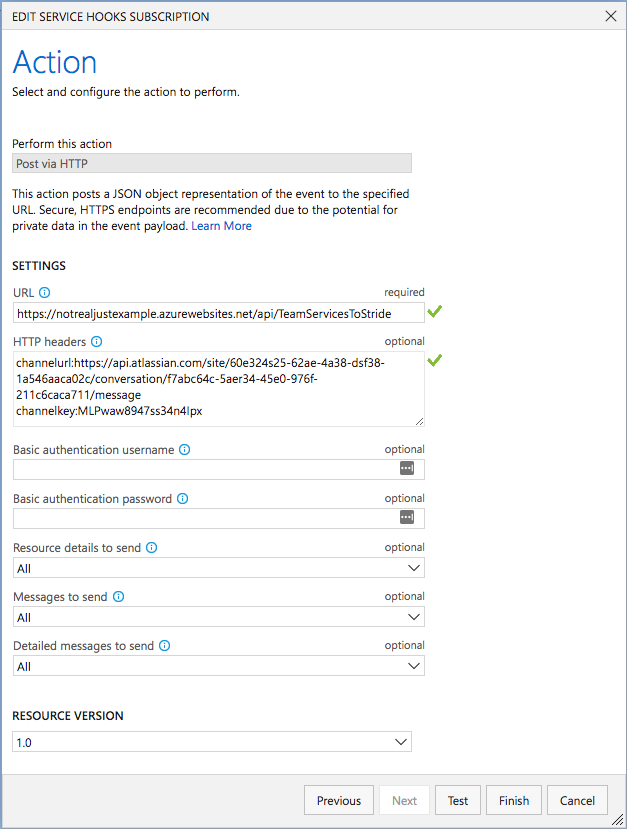
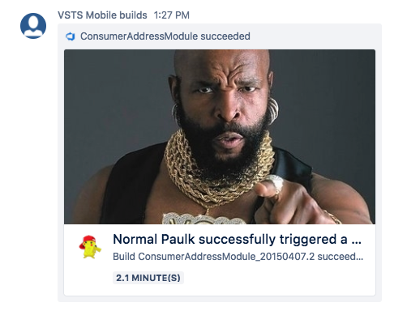

# TeamServicesToStride
A Azure function, responsible to recieve informations from Visual Studio Team Services, format them, and report nicely into [Atlassian Stride](https://www.stride.com/how-it-works).


The idea is that you are able to setup a webhook url to post to, when a build definition completes in VSTS. This webhook should call this Azure Function which converts the VSTS payload to a Stride message and posts it to the channel you configure.

This is a quick-and-dirty adaptation from the original code [here](https://github.com/mikkelhm/TeamServicesToSlack).

## How to use
1. Setup a webhook in VSTS. If you do not know how, read [this](https://docs.microsoft.com/en-us/vsts/service-hooks/services/webhooks?view=vsts).
2. As the URL enter your hosted version URL, if not using a custom URL it will be something like: `https://yourfunctionname.azurewebsites.net/api/TeamServicesToStride`
3. To send the message to a specific channel (or private conversation) in Stride, retrieve a conversation token and the associated URL. Learn more at this [link](https://documentation.backtrace.io/stride/) (follow up to 'Integration' and note the key and URL)
4. Add the `channelurl` and `channelkey` headers in the VSTS webhook configuration to setup the channel where the build messaged will land. See the example underneath:

```
channelurl:https://api.atlassian.com/site/603432425-62ae-4a38-b6b8-1a54623422c/conversation/f7abc64c-5ba3-45e0-976f-211c6243sfd711/message
channelkey:MLWEWkjh897n4Ipx
```

Note: each header needs to be on a seperate line. Header and value is separated by a colon.

A fully configured webhook (with sample data) can be seen in the screen underneath.



You can test by pushing the 'Test' button. You should receive a sample succeeded build notification. Then save by pressing 'Finish' and you should receive your messages in Stride!


